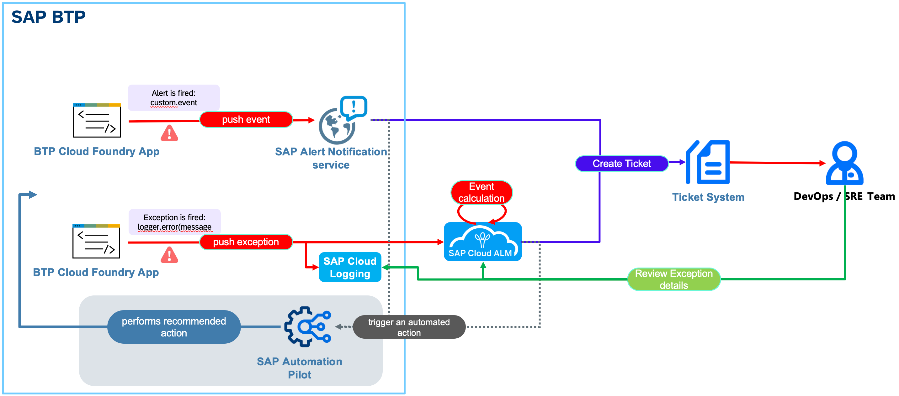

# AD263 - Configure Alerting for SAP BTP Using SAP Cloud ALM!

## Description

This repository contains the material for the SAP TechEd 2023 session called AD263 - Configure Alerting for SAP BTP Using SAP Cloud ALM.

Get an overview regarding the coverage of the SAP Cloud ALM tool for use with the different components of SAP Business Technology Platform (SAP BTP). Configure some of the use cases, from configuration of data collection down to the integration of third-party consumers such as ticket systems. Learn how you can replace existing scenarios of SAP Alert Notification service for SAP BTP with SAP Cloud ALM. See how to enhance, customize, and troubleshoot integration to third-party event consumers.

## Overview

Reliability plays a central role, especially in hybrid landscapes that contain software-as-a-service (SaaS) cloud services, managed cloud components, and on-premise components. The different components involved must be monitored to maintain reliable operations at the application level. In case of an alert, a swift and ideally automatic reaction is required. SAP Cloud ALM provides monitoring applications for various components running in the cloud as well as on-premise.

This session introduces attendees to the usage of SAP Alert Notification service as BTP local event routing solution and to SAP Cloud ALM as central observability solution for your whole SAP Solution Landscape. Especially in this session we will focus on the capabilities for customer developed applications in SAP BTP Cloud Foundry. You will learn how connect a PaaS application to SAP Cloud ALM, how to navigate Health Monitoring and Integration & Exception Monitoring and how to set up alerts and notifications. To react to alerts, you will learn how to forward the event situations from SAP Cloud ALM to external 3rd party incident management tools.

The gray marked part of the scenario is an outlook of how you can also integrate autohealing capabilities in the scenario. This is explained in deeper details in [Hands-on session XP270](https://github.com/SAP-samples/teched2023-XP270/).

## Requirements

The requirements to follow the exercises in this repository
- Very basic knowledge in BTP Cockpit
- Please use the Chrome browser on your Teched laptop

## Exercises

- [Exercise 0 - Getting Started](exercises/ex0/)
- [Exercise 1 - Configure Alert Notification Service](exercises/ex1/)
- [Exercise 2 - Configuration and Usage of SAP Cloud ALM](exercises/ex2/)
- [Exercise 3 - Configure Integration with External Ticket Management System from Cloud ALM](exercises/ex3/)
- [Exercise 4 - End-to-End Execution](exercises/ex4/)
- [Exercise 5 (Optional) - Excursion – Instrument BTP PaaS Java Application ](exercises/ex5/)
- [Exercise 6 (Optional) - Alert Notification service - Send a Notification Email based on a custom event](exercises/ex6/)
- [Exercise 7 (Optional) -  Alert Notification service - Trigger an Ops Remedtiation Command (via SAP Automation Pilot)](exercises/ex7/)

## Background Information

- [Excursion - Cloud ALM instrumentation (optional)](exercises/ex5/)

## Presentation
Access the ...
* Session presentation: [AD263@SAP\_TechEd\_2023.pdf](./exercises/img/AD263@SAP_TechEd_2023.pdf)

## Contributing
Please read the [CONTRIBUTING.md](./CONTRIBUTING.md) to understand the contribution guidelines.

## Code of Conduct
Please read the [SAP Open Source Code of Conduct](https://github.com/SAP-samples/.github/blob/main/CODE_OF_CONDUCT.md).

## How to obtain support

Support for the content in this repository is available during the actual time of the online session for which this content has been designed. Otherwise, you may request support via email to [cloudalm@sap.com](mailto:cloudalm@sap.com).

## License
Copyright (c) 2022 SAP SE or an SAP affiliate company. All rights reserved. This project is licensed under the Apache Software License, version 2.0 except as noted otherwise in the [LICENSE](LICENSES/Apache-2.0.txt) file.
