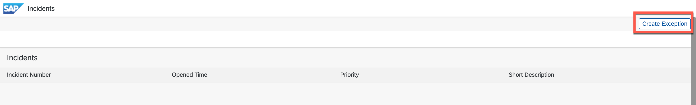

# Exercise 0 – Getting Started

## Find your group Number

During this Teched exercise, you will use a Java application deploy it into an SAP BTP subaccount. You will then configure the Integration and Exception Monitoring this Java application in a shared SAP Cloud ALM. To avoid that it comes to conflicts between two applications, it is very important that you know your place number and execute the exercise using this place number. Please check the sign on your table. The number on this sign is your place number.


**Please replace the XXX in the excercises always with your place number!**

### Login Information

Please replace the _**XXX**_ in the user name with your place number (e.g. AD263_001@education.cloud.sap).

In the SAP BTP Cockpit, you will only see the subaccount that is relevant for you, based on your place number.

| Application | User ID | Password | URL |
|---|---|---|---|
| SAP Cloud ALM URL | AD263_**XXX**@education.cloud.sap | coming soon | [SAP Cloud ALM](https://ad263-ptnlz9xc.eu10.alm.cloud.sap/launchpad) |
| SAP BTP Cockpit | AD263_**XXX**@education.cloud.sap | coming soon | [BTP Global Account](https://emea.cockpit.btp.cloud.sap/cockpit/?idp=tdct3ched1.accounts.ondemand.com#/globalaccount/e2a835b0-3011-4c79-818a-d7767c4627cd) |

## Connect to SAP BTP CF Subaccount

To access all BTP accounts please logon with the credentials to the BTP Global Account for TechEd 2023 Hands-On Sessions:

<https://emea.cockpit.btp.cloud.sap/cockpit/?idp=tdct3ched1.accounts.ondemand.com#/globalaccount/e2a835b0-3011-4c79-818a-d7767c4627cd/>

Your trainer will provide:

```
Username: <AD263-XXX@education.cloud.sap>
```

> [!IMPORTANT]
> XXX is your group number. Please replace in all occurences during the excercises

Please connect via browser to the provided URL and use your credentials to log in.


After successful logon you see SAP BTP Cockpit global account overview two different subaccounts:

- AD263: this is the subaccount where SAP Cloud ALM and SAP BTP Alert Notification service is deployed
- AD263-XXX ***(replace XXX with your group number)***: this is the subaccount with the managed PaaS application used during the hands-on exercise


Select Subaccount: AD263-XXX ***(replace XXX with your group number)***

## Demo Application for this excercise

To demonstrate the different functionality a demo application was deployed to your group subaccount AD263-XXX ***(replace XXX with your group number)***. This demo application will service two different purposed:

1. Incident Management
	- Display incidents and incident details
	- provide API to create incidents remotely (e.g. from Cloud ALM or from Alert Notification Service)
	- **Note:** In customer environments incident management can be handled by a broad variety of Incident Management Tools provided by different vendors. In this hands-on session we will use this mock application to simulate an Incident Management tool with limited functionality. Please note that SAP does not offer or recommend any specific solution.
2. Demonstrate instrumentation of customer applications for SAP Cloud ALM and be able to raise exceptions on demand for demo purposes

To access the demo application please open the space AD263-XXX ***(replace XXX with your group number)***.


Select the frontend for application teched-incident-demo


By clicking on the application route the demo application in your space will open. You will also need this URL for further purposes. So please copy the URL into a notepad of your laptop.


The demo app will open

1. In this area incidents are displayed and navigation to incident details is possible
2. With the button Create Exception you can manually trigger exception generation from this application

Keep the demo app open in a separate tab of your browser. During this excercise we will come back here multiple times.

## Check Cloud ALM instrumentation of the Demo Application (Optional)

The complete procedure how to instrument customer developed applications is described in the SAP Cloud ALM Expert Portal
<https://support.sap.com/en/alm/sap-cloud-alm/operations/expert-portal/data-collection-infrastructure.html>

See also the Hands-On XP261 Observability for Your SAP BTP Applications with SAP Cloud ALM for a step-by-step explanation. In our example we will use the instrumentation for java backend service.

### Check Connectivity from SAP BTP CF to SAP Cloud ALM (optional)

Navigate to Connectivity -> Destinations


Verify that the Destination CALM\_datacollector\_AD263-XXX ***(replace XXX with your group number)*** is created as shown below. Please do not change the destination!
> [!NOTE]
> A seperate destination to authenticate the data transfer from the BTP Cloud Foundry Tenant to the SAP Cloud ALM tenant is only required in PaaS scenarios. For SaaS scenarios using the Open Telemetry based Data Collection and Routing Infrastructure this is not necessary.


Execute Check Connection


Please make sure connection check is successful. The response “404: Not found” is normal as the API endpoint does not provide a default URL.

### Check Cloud ALM Intrumentation for Demo Application (optional)

To enable data collection in a custom application the Open Telemetry Java Agent and the SAP Otel Extensions must be instrumented in the application. In your demo account this has been already done. To see the configuration please open the Cloud Foundry space where the applications are deployed


Navigate to the the Java Backend Service of your demo application


The instrumentation is done via user provided variable JB\P_CONFIG\_JAVA\_OPTS


With the given parameters the instrumentation of the application is done. With the enablement of the SAP Otel Extensions important technical KPIs are automatically collected and transfered to SAP Cloud ALM.

```
javaagent:BOOT-INF/lib/opentelemetry-javaagent-1.29.0.jar 
-Dotel.javaagent.enabled=true: enables the Open Telemetry Agent
-Dotel.javaagent.extensions=BOOT-INF/lib/otel-agent-ext-java-1.5.4.jar: includes the SAP Otel Extension library
-Dotel.resource.attributes=account=AD263-XXX,calmTenantId=<guid>: describes space name and space id of your BTP CF account
-Dotel.service.name=teched-incident-demo: describes the name of the application to be shown in Cloud ALM

```

## Trigger Exception from Demo Application
Navigate to your BTP subaccount AD263-XXX ***(replace XXX with your group number)***

![ref1]

Navigate to Cloud Foundry -> Spaces


Open Space AD263-XXX


Select the frontend for application teched-incident-demo


By clicking on the application route the demo application in your space will open.


Please click the button `Create Exception` to raise some example exceptions from this Application.


After triggering the exception a toast confirming the result is shown.


> [!NOTE]
> How exceptions are raised in the customer applications: 

Exceptions in this sample application are created with slf4j logging facility. The generic approach to raise an exception is done as shown in the code snippet below

```
import org.slf4j.Logger;
import org.slf4j.LoggerFactory;

Logger logger = LoggerFactory.getLogger(loggerName);
logger.error(message)
```

## Review Exception from Demo Application in Cloud Logging Service

The log messages created by the sample application are instrumented to send the generated exceptions to Cloud Logging Service. In Cloud Logging Service the local observability and detailed exception analysis can be performed. For the scenario of sending the exception information from BTP CF PaaS Applications to Cloud ALM the Cloud Logging Service is optional. The data forwarding to SAP Cloud ALM works independently.

<a name="_toc146285036"></a>To show the generated exceptions logon with the credentials to your subaccount AD263-XXX of the the BTP Global Account for TechEd 2023 Hands-On Sessions:

<https://emea.cockpit.btp.cloud.sap/cockpit#/globalaccount/e2a835b0-3011-4c79-818a-d7767c4627cd>

Navigate to your subaccount AD263-XXX ***(replace XXX with your group number)***


1. Click on Instances and Subscriptions
1. Navigate to the details of Instance CLS by clicking on the arrow on the right side of the instance
1. Click on Button view Credentials<br> 

1. Copy the values for dashboard-username and dashboard-password into Notepad on your laptop. You need them in the next step to logon to the dashboard
1. Click on the instance name cls to open the Logging Service dashboard<br>

1. ` `Logon with the credentials you retrieved in the previous step<br>

1. Select the tenant as ‘Global’<br>

1. Navigate in the Dashboard to discover<br>

1. Review the Exceptions<br>


## Summary
- You have now access to the Demo Application for this Hands-on session.
- You are able to trigger exceptions on demand to simulate erroneous behavior of a customer developed BTP CF Java application
- You are able to view incidents created by SAP Cloud ALM or SAP BTP Alert Notification Service

Continue to - [Exercise 1](../ex1/README.md)
