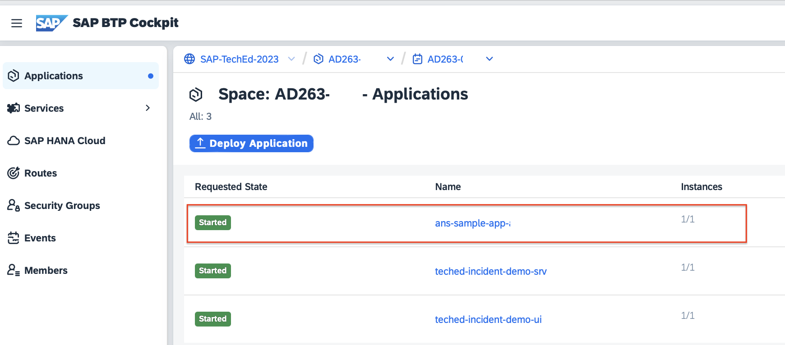

# Exercise 0 – Getting Started

## Find your group Number

During this Teched exercise, you will use a Java application deployed into an SAP BTP subaccount. You will then configure Integration and Exception Monitoring for this Java application in a shared SAP Cloud ALM. Execute the exercises only with your assigned  number to avoid conflicts. You can find your assigned number on the sign on your table.


> [!IMPORTANT]
> Please replace the XXX in the excercises always with your assigned number!


### Login Information

Please replace the _**XXX**_ in the user name with your assigned number (e.g. ad263-001@education.cloud.sap).

In the SAP BTP Cockpit, you will only see the subaccount that is relevant for you, based on your assigned number.

| Application | User ID | Password | URL |
|---|---|---|---|
| SAP Cloud ALM URL | ad263-**XXX**@education.cloud.sap | *** | [SAP Cloud ALM](https://cloud-alm.url/launchpad) |
| SAP BTP Cockpit | ad263-**XXX**@education.cloud.sap | *** | [BTP Global Account](https://emea.cockpit.btp.cloud.sap/cockpit/) |

## Connect to SAP BTP CF Subaccount

click on the BTP Global Account Link and enter username and password

Please connect via browser to the provided URL and use your credentials to log in.


After successful logon you see SAP BTP Cockpit global account overview two different subaccounts:

- AD263: this is the subaccount where SAP Cloud ALM is deployed
- AD263-XXX ***(replace XXX with your group number)***: this is the subaccount with the managed PaaS application used during the hands-on exercise


Select Subaccount: AD263-XXX ***(replace XXX with your group number)***


## Demo Application for Alert Notification service 

To demonstrate few possible use cases releated to the Alert Notification service, there is a demo application already deployed to your group subaccount AD263-XXX ***(replace XXX with your group number)***. The demo application in question is going to be covered in these three sceanrios:

- [Exercise 1 -  Alert Notification service - Create a Ticket in a Ticket System based on a custom event](../ex1/README.md)
- [(Optional) Exercise 6 - Alert Notification service - Send a Notification Email based on a custom event](../ex6/README.md)
- [(Optional) Exercise 7 -  Alert Notification service - Trigger an Ops Remedtiation Command (via SAP Automation Pilot)](../ex7/README.md)

The main concept behing the scenarios is that the cloud app will trigger events which are going to be ingested into the Alert Notification service API. Once that is done, based on configurations made within the Alert Notification service (covered in the upcomming excercices) the Alert Notificaiton service is going to trigger actions such as: 
- create a ticket in an Incident Management (Ticketing system);
- send an alert via email;
- fire an automated remediation action. 

> [!NOTE]
> The Demo Application for Alert Notification service is instumented with an Open Source Java client library so that the application can be configured to push events to the Alert Notificaiton service based on a certain logic. For more details about the library you can check out this link: [Java Client Library (Open Source)](https://help.sap.com/docs/alert-notification/sap-alert-notification-for-sap-btp/integrating-with-custom-application?state=DRAFT&q=library#open-source-java-client-library)

> [!NOTE]
> Any custom app can be integrated to Alert Notification service. If interested in - please check out this link: [Integration with a custom app](https://help.sap.com/docs/alert-notification/sap-alert-notification-for-sap-btp/integrating-with-custom-application). 

**Note:** In customer environments incident management can be handled by a broad variety of Incident Management Tools provided by different vendors. In this hands-on session we will use a mock application (already deployed in your sub-accoint) to simulate an Incident Management tool with limited functionality. Please note that SAP does not offer or recommend any specific solution.

To access the demo application please open the space AD263-XXX ***(replace XXX with your group number)***.



You will find an app named `ans-sample-app-{your_user_id}` where your {user_id} is the one associated to your subaccount, e.g. ad263-002 , ad263-003, ad263-n+1

## Demo Application for Cloud ALM 

To demonstrate the different functionalities a demo application was deployed to your group subaccount AD263-XXX ***(replace XXX with your group number)***. This demo application will service two different purposes:

1. Incident Management
	- Display incidents and incident details
	- The application provides a create incident API. SAP Cloud ALM and ANS call this API to create incidents
	- **Note:** In customer environments incident management can be handled by a broad variety of Incident Management Tools provided by different vendors. In this hands-on session we will use this mock application to simulate an Incident Management tool with limited functionality. Please note that SAP does not offer or recommend any specific solution.
2. Demonstrate instrumentation of customer applications for SAP Cloud ALM and be able to raise exceptions on demand for demo purposes

To access the demo application please open the space AD263-XXX ***(replace XXX with your group number)***.


Select teched-incident-demo-ui


By clicking on the application route the demo application in your space will open. You will also need this URL for further purposes. So please copy the URL into a notepad of your laptop.


The demo app will open

1. In this area incidents are displayed and navigation to incident details is possible (in the beginning of the excercise the table will be empty)
2. With the button Create Exception you can manually trigger exception generation from this application

Keep the demo app open in a separate tab of your browser. During this excercise we will come back here multiple times.

## Cloud ALM instrumentation of the Demo Application

The complete procedure how to instrument customer developed applications is described in the SAP Cloud ALM Expert Portal
<https://support.sap.com/en/alm/sap-cloud-alm/operations/expert-portal/data-collection-infrastructure.html>

See also the Hands-On XP261 Observability for Your SAP BTP Applications with SAP Cloud ALM for a step-by-step explanation. For the purpose of this session the instrumentation has been already provided.

## Trigger Exception from Demo Application

Navigate to your BTP subaccount AD263-XXX ***(replace XXX with your group number)*** and navigate to Cloud Foundry -> Spaces


Open Space AD263-XXX


Select teched-incident-demo-ui


By clicking on the application route the demo application in your space will open.


Please click the button `Create Exception` to raise some example exceptions from this Application.


After triggering the exception a toast confirming the result is shown.<br>


> [!NOTE]
> Exceptions in this sample application are created with slf4j logging facility. The generic approach to raise an exception is done as shown in the code snippet below

```
import org.slf4j.Logger;
import org.slf4j.LoggerFactory;

Logger logger = LoggerFactory.getLogger(loggerName);
logger.error(message)
```

## Review Exception from Demo Application in Cloud Logging Service

The log messages created by the sample application are instrumented to send the generated exceptions to Cloud Logging Service. In Cloud Logging Service the local observability and detailed exception analysis can be performed. For the scenario of sending the exception information from BTP CF PaaS Applications to Cloud ALM the Cloud Logging Service is optional. The data forwarding to SAP Cloud ALM works independently.

<a name="_toc146285036"></a>To show the generated exceptions logon with the credentials to your subaccount AD263-XXX of the the BTP Global Account for TechEd 2023 Hands-On Sessions:

<https://emea.cockpit.btp.cloud.sap/cockpit/?idp=tdct3ched1.accounts.ondemand.com#/globalaccount/e2a835b0-3011-4c79-818a-d7767c4627cd><br>


Navigate to your subaccount AD263-XXX ***(replace XXX with your group number)***


1. Click on Instances and Subscriptions
1. Navigate to the details of Instance CLS by clicking on the arrow on the right side of the instance
1. Click on Button view Credentials<br> 

1. Copy the values for dashboard-username and dashboard-password into Notepad on your laptop. You need them in the next step to logon to the dashboard
1. Click on the instance name cls to open the Logging Service dashboard<br>

1. ` `Logon with the credentials you retrieved in the previous step<br>

1. Select the tenant as ‘Global’<br>

1. Navigate in the Dashboard to discover<br>

1. Review the Exceptions<br>


## Summary
- You are able to view application which can create exceptions and display incidents created by SAP Cloud ALM or SAP BTP Alert Notification Service
- You are able to access the Alert Notification Service configuration UI
- You understand how exceptions can be created in customer applications on BTP platform
- You are able to review exceptions in Cloud Logging Service

Continue to - [Exercise 1](../ex1/README.md)
