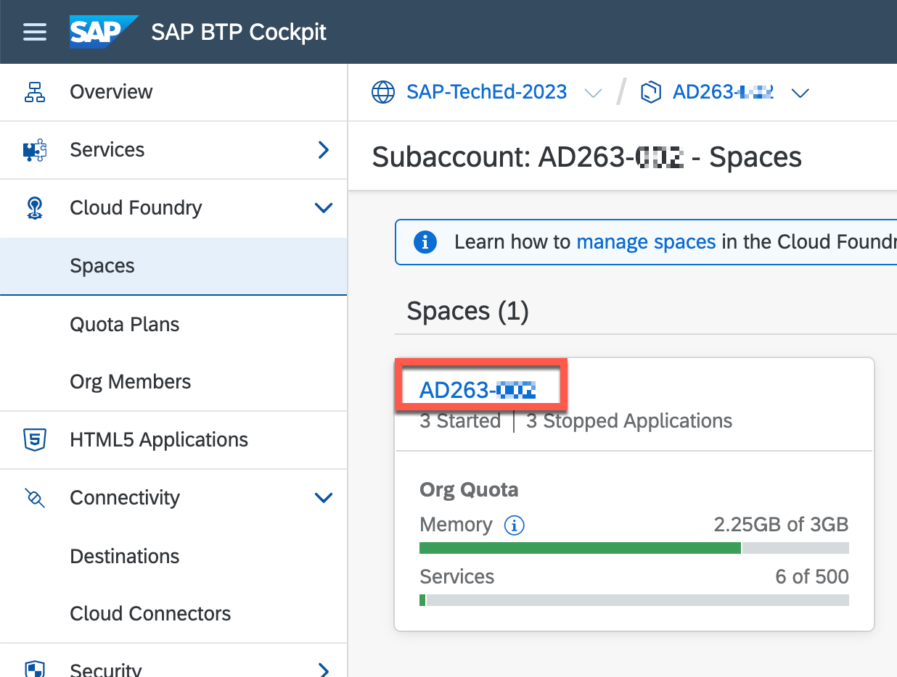
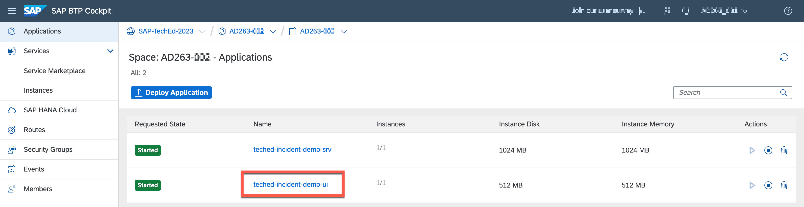

# Exercise 2 - Prepare and Configure SAP Cloud ALM

Logon to the AD263 SAP Cloud ALM Tenant:

<https://ad263-ptnlz9xc.eu10.alm.cloud.sap/launchpad>

Select the **tdct3ched1.accounts.ondemand.com** Identity Provider. Use the credentials as provided in Excercise 0.

After the logon the Launchpad of SAP Cloud ALM is displayed

## Check Landscape Management Service

Navigate to Landscape Management from SAP Cloud ALM Launchpad

Open and define a scope in the Scope Selector for Landscape Management Service

1. Click: Toggle Filter Bar to show search criteria
1. Select Managed Object Type: Service, System
1. Click: Go to load the list of service types
1. Click: Select all in the result list to show all available service types
1. Click Apply to close the scope selection and show the services and systems

In the dashboard loaded you see an overview of all systems and services available in the SAP Cloud ALM tenant. The dashboard entry groups those by Managed Object Type. In each tile you see how many objects of this type are already configured and collecting data, how many are paused for monitoring and how many are new and have not yet been configured. Clicking on any type you can navigate to the list of individual Managed Objects of this type.

Continue the exercise by selecting the tile SAP BTP Cloud Foundry environment

Select the SAP BTP CF AD263-XXX ***(replace XXX with your group number)*** service where your Demo Application is deployed

Please review the details of the service. Please verify the Subdomain and Subaccount ID shown here and in in the BTP Cockpit are identical.

## Check Health Monitoring for SAP BTP CF Demo Application

Navigate to Health Monitoring from SAP Cloud ALM Launchpad

As part of the preparation of your managed SAP BTP CF service the Java application has been instrumented with the OpenTelemetry Java agent and the SAP OpenTelemetry Agent Extensions. As such a set of technical KPI’s for this application is automatically collected for the application to monitor the status of the application.

Open the scope selection and define a scope to show only relevant managed objects for this excercise:

1. Click: Toggle Filter Bar
1. Select Service Type: SAP BTP, Cloud Foundry environment
1. Click Go to load the list of services
1. Filter the list by searching for AD263-XXX ***(replace XXX with your group number)***
1. Check the line with AD263-XXX ***(replace XXX with your group number)***
1. Click on Apply to active this scope

As result you should see the entry dashboard for Health Monitoring only with one tile for SAP BTP, Cloud Foundry environment and one service.

Navigate to SAP BTP Cloud Foundry environment and select the service AD263-XXX ***(replace XXX with your group number)*** where your Demo Application is deployed

In the following screen you can see all metrics collected for the health status of the application. For details each metric can be evaluated further and history data for the metric can be shown

If multiple applications or multiple instances are deployed then for each application/instance a separate measurement is visible. For the application teched-incident-demo (this is the application name as provided in the application instrumentation) please review the history

History Chart can be reviewed for the metric

Please check other metrics for this application. All metrics shown here are available by default and are provided as part of the SAP Otel extension package as automatic instrumentation. There is no development needed to enable those metrics.

## Configure Integration & Exception Monitoring

Navigate to Integration & Exception from SAP Cloud ALM Launchpad

The application opens the first time with a scope selection. The scope selected will be stored for your user and next time you open the application the same scope is automatically used

1. Opens the scope selector (at first application start it is opened automatically)
1. Managed Component Selection: Select Business Services, Services and Systems
1. Service Status: Select All (by default only services configured in Integration and Exception Monitoring are selected, as you configure a new service you need to select All)
1. Click on Go to load the list of managed components according to the given filter criteria
1. Select Managed Component AD263-XXX ***(replace XXX with your group number)***
1. Click on Apply to Load the application with the selected scope

The application starts with an overview page showing the status of all managed components in your scope

As AD263-XXX ***(replace XXX with your group number)*** was not yet used or configured for Integration and Exception Monitoring the configuration for this service needs to be started

1. Click on the configuration button
1. Select your BTP CF service AD263-XXX ***(replace XXX with your group number)*** and click the service name 
Navigate to the Monitoring configuration of your service
 

Toggle the Active Switch for Category Java Application Logs and click save. This enables the data collection of Java Application logs for all customer created Java application in this BTP CF subaccount. The configuration is transferred to the subaccount and data collection and transfer of data starts within the next minute.

Without this toggle switch set to active, even though the application is instrumented and might create errors, the errors are not transferred to SAP Cloud ALM. This mechanism is in place to ensure that only data for metrics which are used in SAP Cloud ALM are collected and transferred, especially as such transfer happens also across data centers as one SAP Cloud ALM tenant manages all customer services independent of the service location.

Switch view to Events settings

Add new Event for `Erroneous Java Application`

Activate `Create Alert` as Event Action and Save

With this setting each time new exceptions are detected in your custom application a new alert is created in the alert inbox for SAP Cloud ALM.

## Trigger Exception from Demo Application

Navigate to your BTP subaccount AD263-XXX ***(replace XXX with your group number)*** and navigate to Cloud Foundry -> Spaces

Open Space AD263-XXX

Select teched-incident-demo-ui

By clicking on the application route the demo application in your space will open.

Please click the button `Create Exception` to raise some example exceptions from this Application.

## Review Exception in SAP Cloud ALM

Navigate to the Home of Integration & Exception Monitoring

1. Click on the Refresh Indicator
1. Click Refresh to manually refresh the current page (by default the current view is refreshed every 5 minutes automatically). The data transfer from your application to SAP Cloud ALM can take up to two minutes
1. Click on the Exceptions to show the exception details 

1. Click on one line to review details of a single exception 

1. Review the Collection Context
1. Review the Correlation Context
1. Review the Process Arguments
1. Navigate to Cloud Logging Service to see the details in local dashboard

## Review Alert for the Exception in SAP Cloud ALM

1. Click on alerting to open the alert page
1. If the list is still empty refresh the view, select one alert
1. Review the alert details

## Summary

- You have now access to the Cloud ALM tenant as central observability solution for this Hands-on session.
- Your managed customer created Java application deployed in BTP CF is available and configured for monitoring in Health Monitoring and Integration & Exception Monitoring in SAP Cloud ALM
- Exceptions from the Demo Application are creating events and alerts in SAP Cloud ALM

Continue to - [Exercise 3](../ex3/README.md)