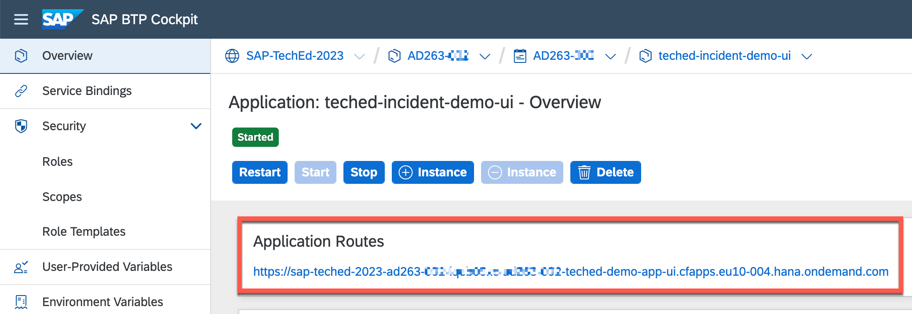

# Exercise 3 - Configure Integration with External Ticket Management System from Cloud ALM

SAP Cloud ALM does not offer a build-in Incident Management functionality. To enable collaboration a 3rd party incident management tool can be integrated with Cloud ALM. The complete step-by-step documentation is available at <https://support.sap.com/en/alm/sap-cloud-alm/operations/expert-portal/intelligent-event-processing/integration-ticket-systems.html>. The following steps explain how to connect the demo application in your BTP CF account as incident management tool.

## Create Destination to your Incident Management Ticket System

### Logon to BTP Cockpit subaccount where your SAP Cloud ALM is deployed

Navigate to Connectivity->Destinations: (direct link) <https://emea.cockpit.btp.cloud.sap/cockpit/?idp=tdct3ched1.accounts.ondemand.com#/globalaccount/e2a835b0-3011-4c79-818a-d7767c4627cd/subaccount/731a2c70-457e-466c-a810-d32cf775c958/destinations>

### Create a Destination to your Incident Management

Find the correct URL for the Incident Application deployed in your subaccount, please logon to your BTP Subaccount AD263-XXX ***(replace XXX with your group number)*** and navigate to Cloud Foundry -> Spaces -> AD263-XXX -> Applications -> teched-incident-demo-ui 



Copy the URL mentioned in Application Routes to notepad.

Now create the destination as below:

```
Destination Configuration: Blank Template
Name: CALM_INCIDENT_AD263-XXX (replace XXX with your group number)
Type: HTTP
Description: Incident for AD263-XXX (replace XXX with your group number)
Proxy Type: Internet
Authentication: NoAuthentication
Use default JDK truststore: yes
```


Save your Destination

### Test Connectivity

Click 


## Create Webhook

Logon to the AD263 Cloud ALM Tenant: <https://ad263-ptnlz9xc.eu10.alm.cloud.sap/launchpad#Shell-home>

Navigate to “External API Management”


Create a new Webhook  AD263-XXX\_Webhook ***(replace XXX with your group number)***


```
Name: AD263-XXX_Webhook (replace XXX with your group number)
Path: /api/v1/tech-ed
External Resource Type: Incident
Destination Source: BTP Destination
Destination Id: CALM_INCIDENT_AD263-XXX (replace XXX with your group number, the destination you have created in the previous step)
Destination Type: Other
```


Save

## Create Subscription

Create a new Subscription  AD263-XXX\_Ticket ***(replace XXX with your group number)***


```
Name: AD263-XXX_Ticket (replace XXX with your group number)
Description: Ticket Application for AD263-XXX ***(replace XXX with your group number)***
Type: Built-in
Resource Type: CALM Event Situation
Webhook: AD263-XXX_Webhook (replace XXX with your group number)
Mapping: AD263 Teched Demo Ticket System (all groups can use the same mapping)
```


The mapping file provided is a definition of the API structure. Your trainer has already provided a mapping file for the Demo Application in your excercise SAP Cloud ALM account.

## Create ticket manually from Alert Inbox

Navigate to Integration and Exception Monitoring in Cloud ALM (<https://ad263-ptnlz9xc.eu10.alm.cloud.sap/shell/run?sap-ui-app-id=com.sap.crun.imapp.ui#/Home>)


Select Open Alerts 


Select one of the open Alerts for your BTP CF Subaccount AD263-XXX ***(replace XXX with your group number)***


Create Ticket


Select your Subscription AD263-XXX\_Ticket ***(replace XXX with your group number)***. The other input fields shall be kept as is. Send the ticket with OK.

If a success message Incident INC<XXXXX> created appears, then your ticket integration was successfully configured.

You can also see the incident in the ticket section of the alert details.

## Review Ticket in Ticket Demo Application

Your newly created ticket shall appear in the list of tickets in the TechEd2023Incident App in your BTP CF Space AD263-XXX ***(replace XXX with your group number)***.


## Summary

- The connectivity between Cloud ALM the your customer ticket system (the Demo Application for this Hands-on Session will act as mock application for this purpose) has been established
- Tickets can be manually created from Cloud ALM in the Ticket system

Continue to - [Exercise 4](../ex4/README.md)
