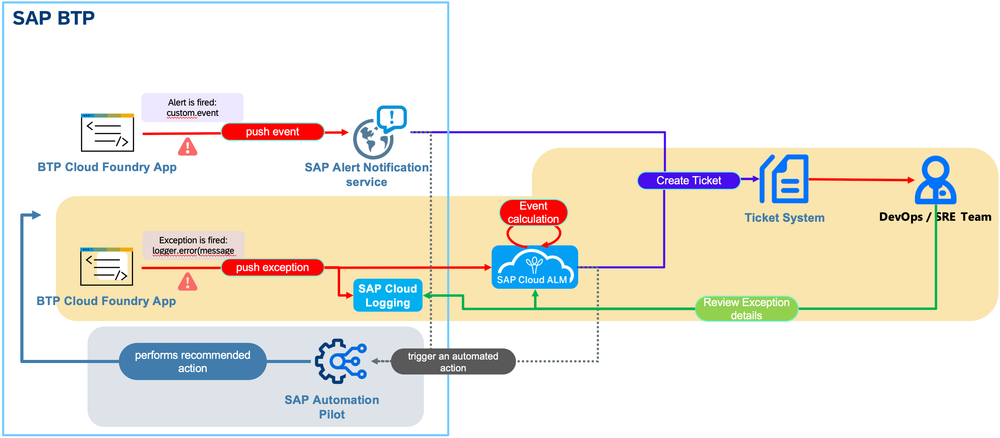
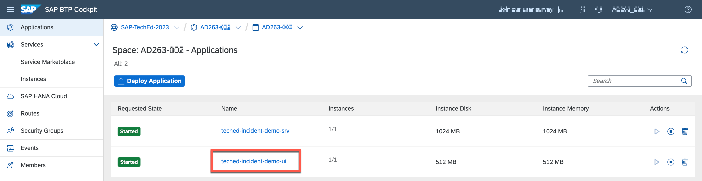
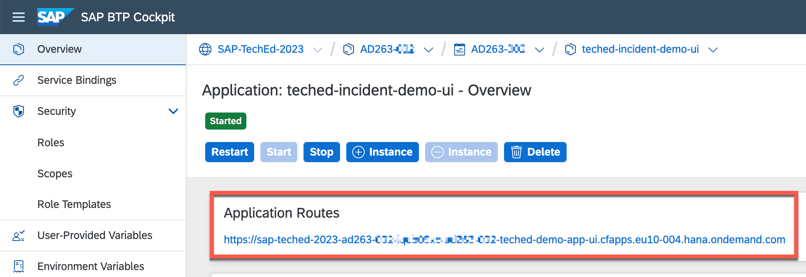
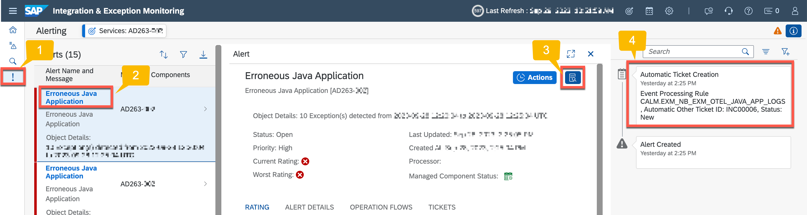
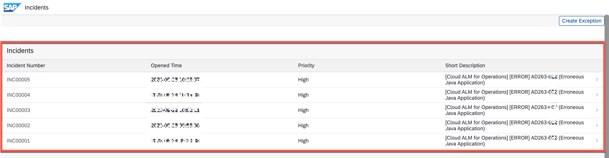

# Exercise 4 - End-to-End Execution

## Demo Scenario

Context

As in the diagramm above shown in this exercise we will now configure enable the full end-to-end flow where the support teams will mainly work with the ticket system to retrieve ongoing incidents and react on those tickets by checking the details in SAP Cloud ALM and SAP Cloud logging service to reduce MTTD and MTTR 

## Configure automatic ticket creation at event in Integration & Exception Monitoring

Navigate to Integration & Exception from Cloud ALM Launchpad

Or use the direct link: [Integration & Exception in SAP Cloud ALM](https://ad263-ptnlz9xc.eu10.alm.cloud.sap/shell/run?sap-ui-app-id=com.sap.crun.imapp.ui#/Home)

1. Click on the configuration button
1. Select your BTP CF service AD263-XXX ***(replace XXX with your group number)***

Navigate to the Events configuration of your service

Activate the Create Ticket Event Action and Assign your Subscription AD263-XXX\_Ticket ***(replace XXX with your group number)***

Save the changes and close

## Trigger Exception from Demo Application

Navigate to your BTP subaccount AD263-XXX ***(replace XXX with your group number)*** and navigate to Cloud Foundry -> Spaces

Open Space AD263-XXX

Select teched-incident-demo-ui

By clicking on the application route the demo application in your space will open.

Please click the button `Create Exception` to raise some example exceptions from this Application.

## Review Exception in SAP Cloud ALM

Navigate to the Home of Integration & Exception Monitoring

1. Click on the Refresh Indicator
1. Click Refresh to manually refresh the current page (by default the current view is refreshed every 5 minutes automatically). The data transfer from your application to Cloud ALM can take up to two minutes
1. Make sure the new exceptions are already availabe here 

Select Open Alerts 

1. Open Alert Inbox
1. Make sure a new alert was created since the last exceptions were received, Wait and refresh if the alert is not yet created. Select the new alert
1. Show action log
1. Here you see now, that the ticket was created automatically. You can also retrieve 

## Review Ticket in Ticket Demo Application

Navigate to your BTP subaccount AD263-XXX ***(replace XXX with your group number)*** and navigate to Cloud Foundry -> Spaces

Open Space AD263-XXX

Select the frontend for application teched-incident-demo

By clicking on the application route the demo application in your space will open.

Your newly created ticket shall appear in the list of tickets in the teched-incident-demo App in your BTP CF Space AD263-XXX ***(replace XXX with your group number)***. It could take up to 5 minutes until the ticket is created.

## Summary

- You have configured the automatic ticket creation for new exceptions via Cloud ALM
- In case of new exceptions created by the customer application automatically new incident tickets are created in the ticket system

**Congratulations: you have finished the excercise!**