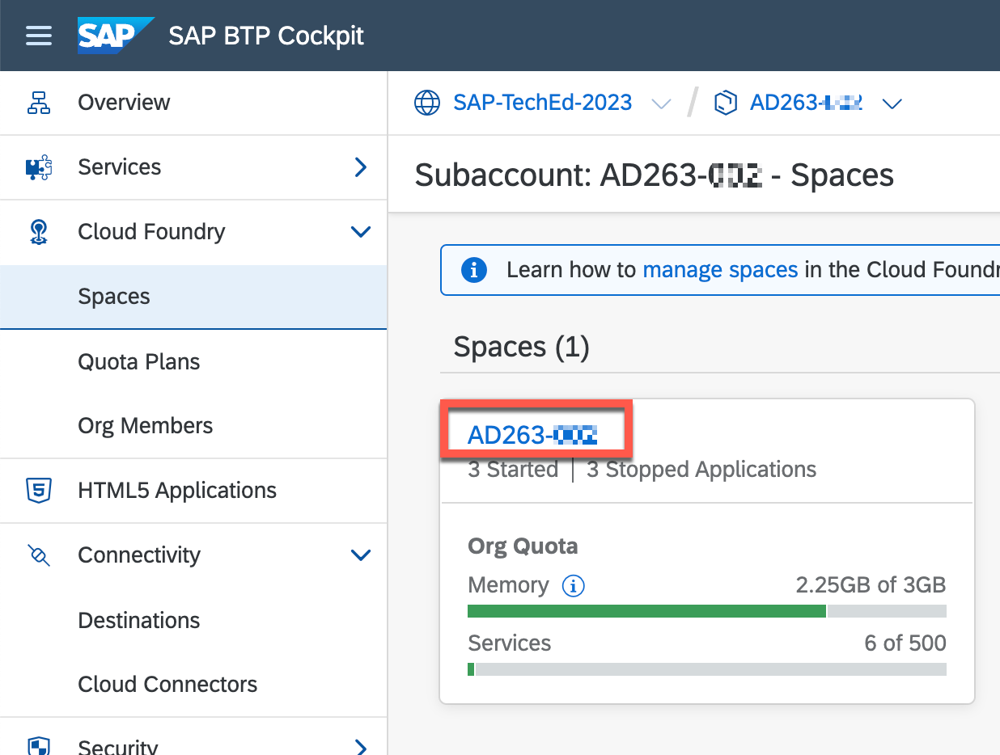
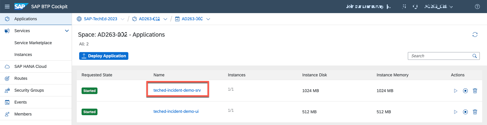
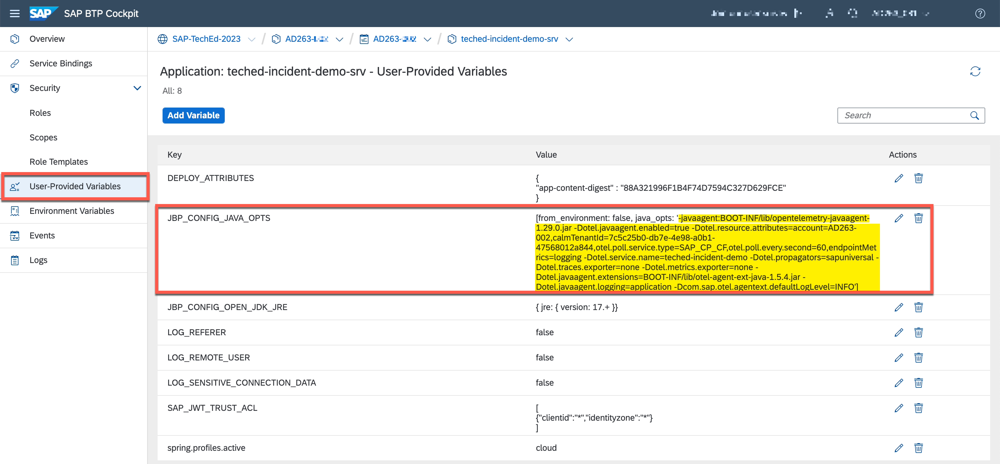

# Excurse – Instrument BTP PaaS Java Application


## Check Cloud ALM instrumentation of the Demo Application 

The complete procedure how to instrument customer developed applications is described in the SAP Cloud ALM Expert Portal
<https://support.sap.com/en/alm/sap-cloud-alm/operations/expert-portal/data-collection-infrastructure.html>

In Hands-On XP261 "Observability for Your SAP BTP Applications with SAP Cloud ALM" a step-by-step explanation how to instrument a customer own Node.js application is shown. In our example we will use the instrumentation for Java backend service. Most steps are very similar so here only the difference is shown.

### Check Connectivity from SAP BTP CF to SAP Cloud ALM 

Navigate to Connectivity -> Destinations


Verify that the Destination CALM\_datacollector\_AD263-XXX ***(replace XXX with your group number)*** is created as shown below. Please do not change the destination!
> [!NOTE]
> A seperate destination to authenticate the data transfer from the BTP Cloud Foundry Tenant to the SAP Cloud ALM tenant is only required in PaaS scenarios. For SaaS scenarios using the Open Telemetry based Data Collection and Routing Infrastructure this is not necessary.


Execute Check Connection


Please make sure connection check is successful. The response “404: Not found” is normal as the API endpoint does not provide a default URL.

### Check Cloud ALM Intrumentation for Demo Application

To enable data collection in a custom application the Open Telemetry Java Agent and the SAP Otel Extensions must be instrumented in the application. In your demo account this has been already done. To see the configuration please open the Cloud Foundry space where the applications are deployed


Select teched-incident-demo-srv


Select User provided variables. The instrumentation is done via user provided variable JB\P_CONFIG\_JAVA\_OPTS


With the given parameters the instrumentation of the application is done. With the enablement of the SAP Otel Extensions important technical KPIs are automatically collected and transfered to SAP Cloud ALM.

```
javaagent:BOOT-INF/lib/opentelemetry-javaagent-1.29.0.jar 
-Dotel.javaagent.enabled=true: enables the Open Telemetry Agent
-Dotel.javaagent.extensions=BOOT-INF/lib/otel-agent-ext-java-1.5.4.jar: includes the SAP Otel Extension library
-Dotel.resource.attributes=account=AD263-XXX,calmTenantId=<guid>: describes space name and space id of your BTP CF account
-Dotel.service.name=teched-incident-demo: describes the name of the application to be shown in Cloud ALM
```
Please verify that the property -Dotel.resource.attributes contains the right values:
- account: AD263-XXX ***(replace XXX with your group number)***
- calmTenantId: The Subaccount ID of your group BTP subaccount. You can find it on the overview page of the subaccount

## Summary
- You learned how to instrument a BTP PaaS application for SAP Cloud ALM

