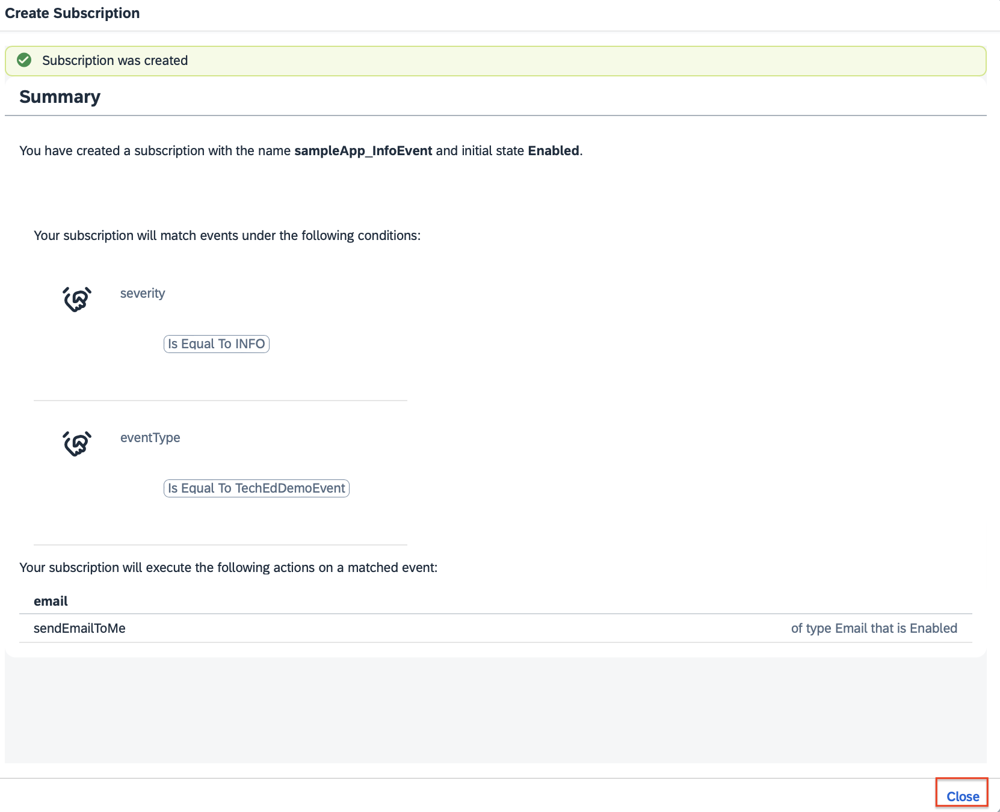

# Exercise 6: (Optional) Alert Notification service - Send a Notification Email based on a custom event 

## Use Case: Solution Diagram

## Use Case: Explained
In this use case there will be a custom event (`Info Notification` - already explained in previous sections) pushed by the ANS Sample App to the Alert Notification service. Based on an active `Subcription` (which cosists of `Conditions` and `Actions`) in Alert Notification service,  the event will be filtered out and an action (send a notification email) will be automatically triggered by the Alert Notification service. 
For a step-by-step guidance - please follow the section below . 

## Use Case: Alert Notification service - Configuration

**Access the Alert Notification service** overview page (as already covered in [Exercise 1 - Access SAP Alert Notification service](https://github.com/SAP-samples/teched2023-AD263/tree/main/exercises/ex1#access-sap-alert-notification-service) )

1. **Create Conditions**

1.1. Create a Condition with "Severity" set to `INFO`

1.1.1.From the left-sidebar menu: select `Conditions` menu item, followed by the button `Create`

1.1.2. Fill in the  details to create the needed condition. In this use case it we need to create a condition so that we can filter out the events based on a particular `severity`. 
* Name:  `severityInfo`
* Description: `EventSeverity set to INFO`
* Label: `severity`
* Condition: use the drop downs so that you can setup the condition correctly = `severity` ->  `Is Equal To` -> `Info`
* Click on `Create` button to save the configuration

* You will see a confirmation screen. Then click on the `Close` button. 

1.2. Create a Condition with "Event Type" set to `TechEdDemoEvent` (if you had already created it in the previous exercises - no need to created it)
> [!NOTE]
> Since there might be events from different sources with severity set to `INFO` it is a good practice to filter out the events also on other parameters. In this use case, we will use also the "Event type" which for all events pushed by the ANS Sample app is set to `TechEdDemoEvent`. Therefore now we build a combination of two conditions `severity` **AND** `eventType` to make a unique filtering for the events.

1.2.1.From the left-sidebar menu: select `Conditions` menu item, followed by the button `Create`

1.2.2. Fill in the  details to create the needed condition. In this use case it we need to create a condition so that we can filter out the events based on a particular `eventType`. 
* Name:  `eventType_TechEdApp`
* Description: `eventType set to TechEdDemoEvent`
* Label: `eventType`
* Condition: use the drop downs so that you can setup the condition correctly = `eventType` ->  `Is Equal To` -> `TechEdDemoEvent`
* Click on `Create` button to save the configuration

* You will see a confirmation screen. Then click on the `Close` button. 

Now you should be able to see an overview of the two conditions you juts have created. 

2. **Create Actions**
As a next step you need to create an action - as per the specific use case - it is needed to create an action for sending a notification email that includes relevant details about the event. To do so follow the steps defined below. 

2.1. From the left-sidebar menu: select `Actions` menu item, followed by the button `Create`

2.2. There is "Create Action" wizzard displayed , please follow these steps:
2.2.1. Select `Email` and click `Next`

2.2.2. Fill in the  details to create the needed action: 
* Name: `sendEmailToMe`
* Description: `send email to my email address`
* Labels: `email`
* Email Address: `{your-email-address`} - provide an email address which you have an access to.
* Click on `Create` button

2.2.3. You will see an confirmation screen that the action has been created. 
*NOTE* You should also check your email inbox and confirm your email address. 

2.2.4. Confirm your email address: access your inbox and find the email sent by the Alert Notification service  - look for an email with a subject `[ACTION REQUIRED] SAP Alert Notification service for SAP BTP. Confirmation Token` and click on follow link as per the screenshot below . 

2.2.5. Click on the confirmation buttion in your browser to confirm your email. 

2.2.6. You will see this confirmation message in your browser.

Now the action `sendEmailToMe` is created, email has been activited and you should see this screen within the "Actions" section. 

3. **Create Subscription**
As a next step you need to create the subscription.

3.1. From the left-sidebar menu: select `Subscriptions` menu item, followed by the button `Create`

3.2. There is "Create Subscription" wizzard displayed , please follow these steps:
3.2.1. Create Subsription: fill in the form with the needed details 
* Name: `sampleApp_InfoEvent`
* Description: `a subscription to be fired for a custom event with severity INFO`
* Labels: `sampleApp`
* State: `On` (this is the default state)

* Click on the `Create` button

3.2.2. Select Conditions: select the conditions you have created and click on the `Assign` button

3.2.3. Select Actions: select the action you have created and click on the `Assign` button

3.2.4. Confirmation screen: you will see a confirmation screen. Click on `Close` button. 

Now you will see the active subscription you just have configured.

#### Use Case: Simulation and Outputs 

Now it is time to simulate the use case and inspect the outputs. To do so , please follow these steps: 

1. Access the ANS Sample App (as already described).
2. Click on the `Push Info Notification`
3. The custom event will be pushed into the Alert Notification sevice Producer API, then Alert Notification service will filter out the event based on the conditions set for the active subcription and it will also trigger the action associated to this very subscription.
4. Check your inbox - you should get the expected email notifcation sent by the Alert Notification service (see an example as per the screenshot below). 

### Summary
Now you have learned how trigger alert notification emails via SAP Alert Notification service based on specific conditions. If you want also to learn how to tirgger Ops automation commands / flows please proceed to [Exercise 7 (Optional) -  Alert Notification service - Trigger an Ops Remedtiation Command (via SAP Automation Pilot)](.../ex7/README.md)

