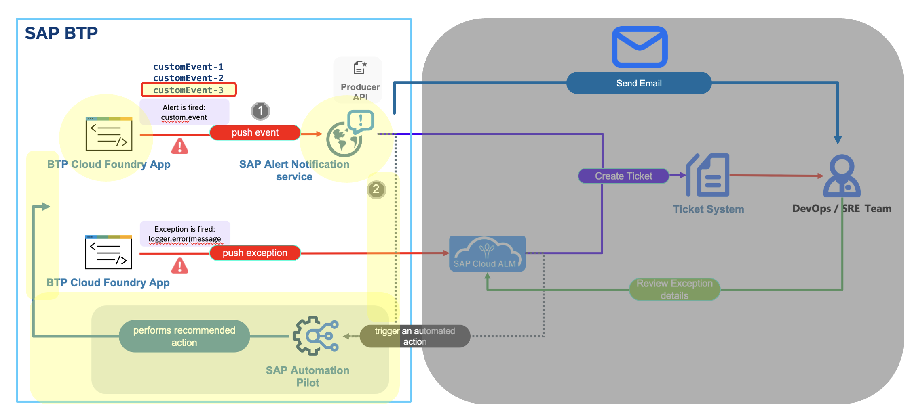

### [OPTIONAL] Use Case 3: Alert Notification service - Trigger an Ops Remedtiation Command (via SAP Automation Pilot)

#### Use Case #3: Solution Diagram

#### Use Case #2: Explained
In this use case there will be a custom event (`Error Notification` - already explained in previous sections) pushed by the ANS Sample App to the Alert Notification service. Based on an active `Subcription` (which cosists of `Conditions` and `Actions`) in Alert Notification service, the event will be filtered out and an action (ops remeditation command via SAP Automation Pilot) will be automatically triggered by the Alert Notification service. Please follow the section below. 

#### Use Case #2: Alert Notification service - Configuration

--- 
### **Want to automate the reactions to your routine problems?**
For the time of the hands-on session, we were only able to set up the notifications from your cloud environment. However, do you think it will be great to have some automatic
reactions upon the routine problems that occur in the platform, e.g. application stopped or crashed for no reason?

For these and more complicated DevOps scenarios that occur everyday to each of us, check out [Automation Pilot](https://help.sap.com/viewer/DRAFT/de3900c419f5492a8802274c17e07049/Cloud/en-US/4536e41c57aa442095ccbac977965f26.html).  
An easy integration to Alert Notification in a few steps is [available](https://help.sap.com/viewer/DRAFT/de3900c419f5492a8802274c17e07049/Cloud/en-US/684d09a964d14d07ac3d6b3a2754765a.html).
---
