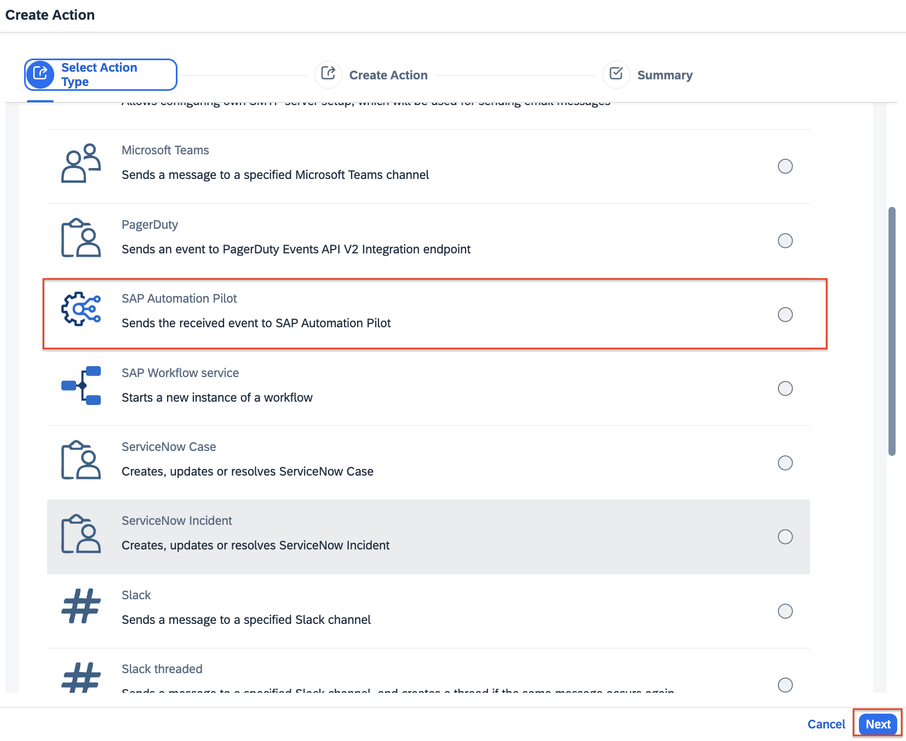
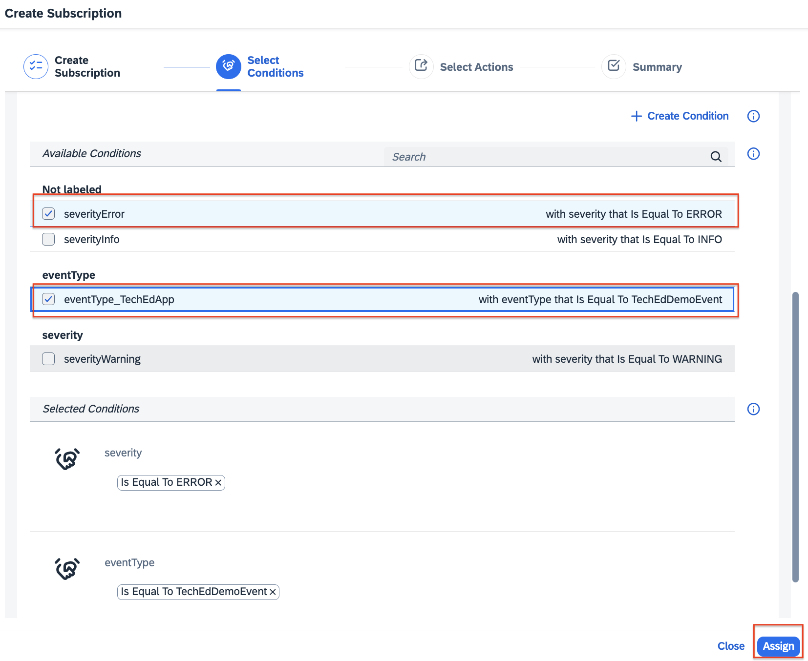
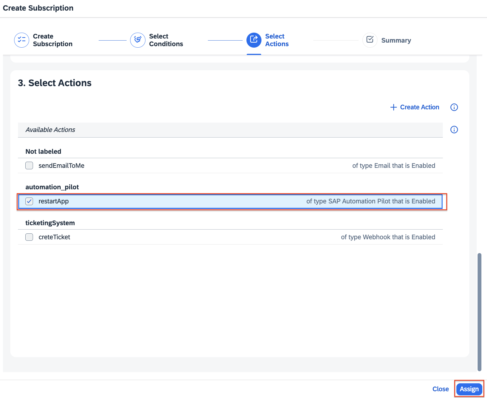
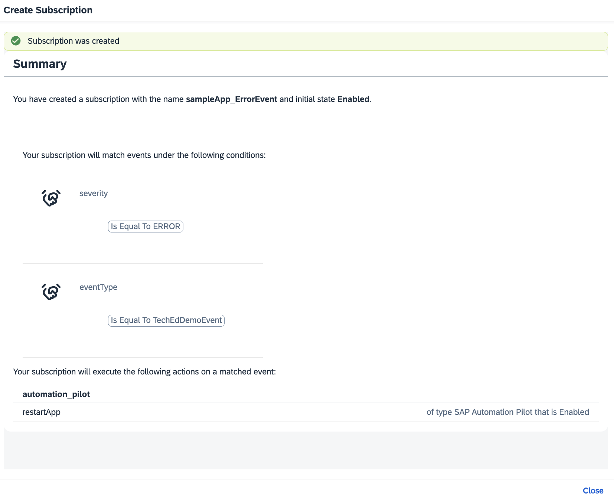
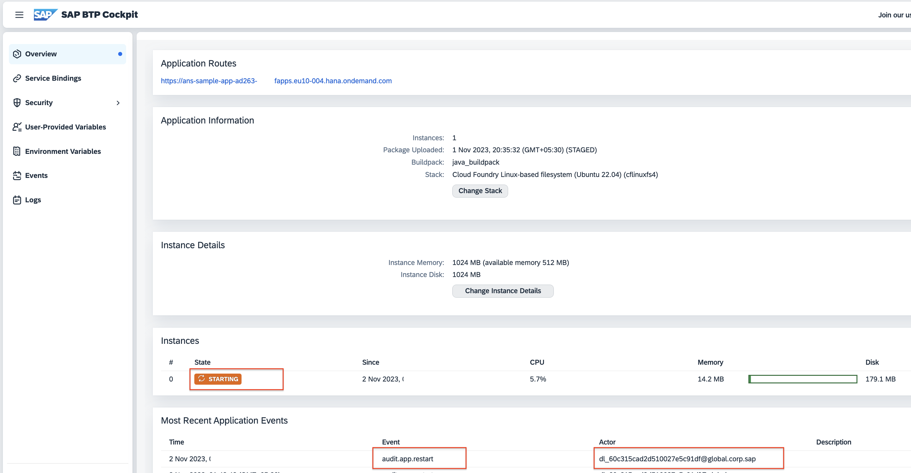

# Exercise 7: (Optional) [ADVANCED] Alert Notification service - Trigger an Ops Remedtiation Command (via SAP Automation Pilot)

## Use Case: Solution Diagram


## Use Case: Explained
In this use case there will be a custom event (`Error Notification` - already explained in previous sections) pushed by the ANS Sample App to the Alert Notification service. Based on an active `Subcription` (which cosists of `Conditions` and `Actions`) in Alert Notification service, the event will be filtered out and an action (an Ops remeditation command via SAP Automation Pilot) will be automatically triggered by the Alert Notification service. Please follow the section below. 

## Use Case: Alert Notification service - Configuration

**Access the Alert Notification service** overview page (as already covered in [Exercise 1 - Access SAP Alert Notification service](https://github.com/SAP-samples/teched2023-AD263/tree/main/exercises/ex1#access-sap-alert-notification-service) )

1. **Create Conditions**

1.1. Create a Condition with "Severity" set to `ERROR`

1.1.1.From the left-sidebar menu: select `Conditions` menu item, followed by the button `Create`
1.1.2. Fill in the  details to create the needed condition. In this use case it we need to create a condition so that we can filter out the events based on a particular `severity`. 
* Name:  `severityError`
* Description: `EventSeverity set to ERROR`
* Label: `severity`
* Condition: use the drop downs so that you can setup the condition correctly = `severity` ->  `Is Equal To` -> `ERROR`
* Click on `Create` button to save the configuration
* You will see a confirmation screen. Then click on the `Close` button. 

1.2. Create a Condition with "Event Type" set to `TechEdDemoEvent`(if you had already created it in the previous exercises - no need to created it)
> [!NOTE]
> Since there might be events from different sources with severity set to `INFO` it is a good practice to filter out the events also on other parameters. In this use case, we will use also the "Event type" which for all events pushed by the ANS Sample app is set to `TechEdDemoEvent`. Therefore now we build a combination of two conditions `severity` **AND** `eventType` to make a unique filtering for the events.

1.2.1.From the left-sidebar menu: select `Conditions` menu item, followed by the button `Create`

1.2.2. Fill in the  details to create the needed condition. In this use case it we need to create a condition so that we can filter out the events based on a particular `eventType`. 
* Name:  `eventType_TechEdApp`
* Description: `eventType set to TechEdDemoEvent`
* Label: `eventType`
* Condition: use the drop downs so that you can setup the condition correctly = `eventType` ->  `Is Equal To` -> `TechEdDemoEvent`
* Click on `Create` button to save the configuration
* You will see a confirmation screen. Then click on the `Close` button. 

2. **Create Actions**
As a next step you need to create an action - as per the specific use case - it is needed to create an action for sending a notification email that includes relevant details about the event. To do so follow the steps defined below. 

2.1. From the left-sidebar menu: select `Actions` menu item, followed by the button `Create`

2.2. There is "Create Action" wizzard displayed , please follow these steps:
2.2.1. Select `SAP Automation Pilot` and click `Next`


2.2.2. Fill in the  details to create the needed action: 
* Name: `restartApp`
* Description: `restart app via SAP Automation Pilot`
* Labels: `automation_pilot`
* Automation Pilot URL: copy/paste this endpoint where a command to restart the respective app is already configured and can be tiggered on demand by Alert Notification service:
  ```
  https://eu10.autopilot.ondemand.com/api/v1/triggers/ans-event?commandReference=techEd2023-T001215R4%3ARestartCfAppDemo%3A1&inputReference=techEd2023-T001215R4%3AbtpTechnicalUser%3A1&tag=feature%3Apriority%3Dmedium
  ```
* Username: `T001215R4-ans`
* Password: `MeH1I&#ax!@83Cfr+O+P59UXdjr5OM`
* Click on `Create` button


2.2.3. You will see an confirmation screen that the action has been created. 


3. **Create Subscription**
As a next step you need to create the subscription.

3.1. From the left-sidebar menu: select `Subscriptions` menu item, followed by the button `Create`

3.2. There is "Create Subscription" wizzard displayed , please follow these steps:
3.2.1. Create Subsription: fill in the form with the needed details 
* Name: `sampleApp_ErrorEvent`
* Description: `a subscription to be fired for a custom event with severity ERROR`
* Labels: `sampleApp`
* State: `On` (this is the default state)
* Click on the `Create` button

3.2.2. Select Conditions: select the conditions you have created and click on the `Assign` button


3.2.3. Select Actions: select the action you have created and click on the `Assign` button


3.2.4. Confirmation screen: you will see a confirmation screen. Click on `Close` button. 


Now you will see the active subscription you just have configured.


#### Use Case #2: Simulation and Outputs 

Now it is time to simulate the use case and inspect the outputs. To do so , please follow these steps: 

1. Access the ANS Sample App (as already described).
2. Click on the `Push Error Notification`
3. The custom event will be pushed into the Alert Notification sevice Producer API, then Alert Notification service will filter out the event based on the conditions set for the active subcription and it will also trigger the action associated to this very subscription.
4. Go back to BTP then navigate to `Cloud Foundry` -> `Spaces` -> `AD263-XXX` -> `Applications` -> `ans-sample-app-{your_user_id}` which is your ANS Sample app. You should be able that the app just has been restarted an automatically triggered command via SAP Automation Pilot. 



--- 
### **Want to automate the reactions to your routine problems?**
For the time of the hands-on session, we were only able to set up the notifications from your cloud environment and trigger also the ops automated reaction. However, do you think it will be great to have some more automatic
reactions upon the routine problems that occur in the platform.

For these and more complicated DevOps scenarios that occur everyday to each of us, check out [Automation Pilot](https://help.sap.com/docs/automation-pilot/automation-pilot/what-is-sap-automation-pilot?version=Cloud).  
An easy integration to Alert Notification in a few steps is [available](https://help.sap.com/docs/automation-pilot/automation-pilot/integrate-with-sap-alert-notification-service-for-sap-btp?version=Cloud).
---


